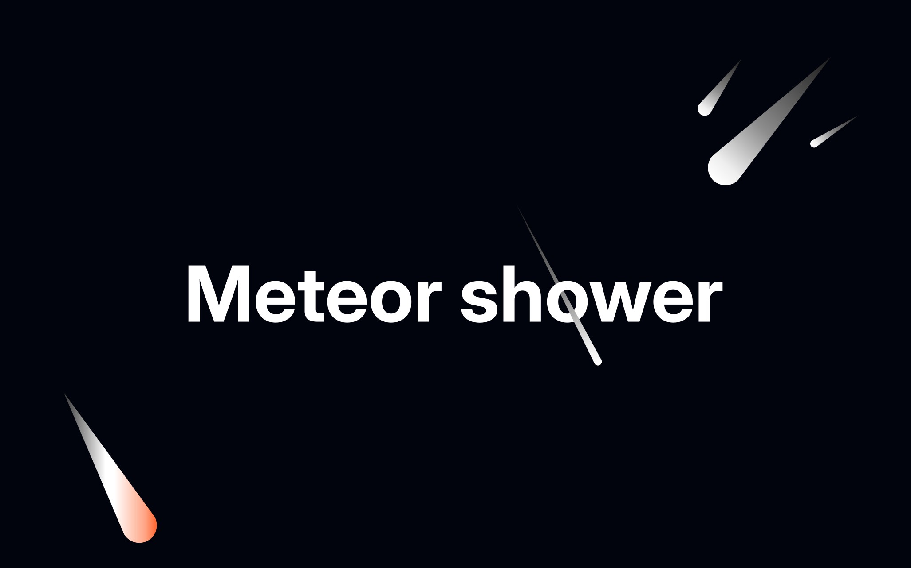
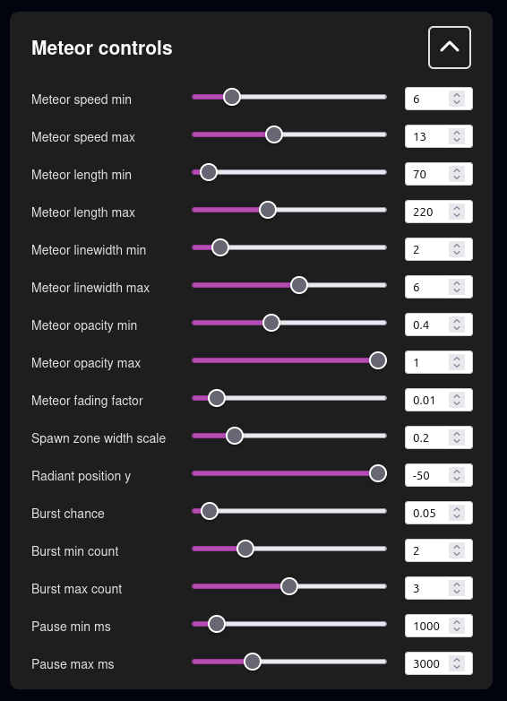

# MeteorShowerEffect



A simple and customizable meteor shower effect created with Vue.js and HTML5 Canvas. This project provides a component that generates an animated meteor shower on a canvas element, with a control panel to adjust various parameters in real-time.

## Live demo

Try it out here: [https://imadsaddik.github.io/MeteorShowerEffect/](https://imadsaddik.github.io/MeteorShowerEffect/)

https://github.com/user-attachments/assets/424499a2-5cf5-40e0-bec7-ade6b0bb1b84

Watch my YouTube tutorial on how to create this effect: [Meteor shower effect tutorial](https://youtu.be/TN-25j35YHs)

## Features

This project allows you to do the following:

- Customize the meteor length, width, and speed.
- Adjust the radiant position of the meteor shower.
- Control the probability of showing meteor bursts and how many meteors to show.
- Adjust the meteor fading factor.
- Control the spawn zone width.
- Adjust the initial opacity of the meteors.
- And the time between each meteor spawn.

All of these parameters can be adjusted in real-time using the following [control panel](./src/components/MeteorControlPanel.vue).



## Installation

This is a Vue.js project, so make sure that you have installed Vue. Here is a link to the [Vue.js documentation](https://vuejs.org/guide/quick-start.html) for more information.

Also make sure to install `pnpm` if you haven't already, as it is used to manage the dependencies in this project. Check out the [pnpm documentation](https://pnpm.io/installation) for installation instructions.

After you have installed Vue and pnpm, you can clone this repository:

```bash
git clone https://github.com/ImadSaddik/MeteorShowerEffect.git
cd MeteorShowerEffect
```

Then, install the dependencies:

```bash
pnpm install
```

Now you can run the development server:

```bash
pnpm run serve
```

You can now open your browser and navigate to `http://localhost:8000/MeteorShowerEffect/` to see the meteor shower effect in action.

## Components

### MeteorDesigner.vue

If you want to design the meteor, import the `MeteorDesigner.vue` component in [App.vue](./src/App.vue). This component allows you to customize the meteor's appearance, including its color, size, and other visual properties.

Use it this way in your `App.vue`:

```vue
<template>
  <MeteorDesigner />
</template>

<script>
import MeteorDesigner from "./components/MeteorDesigner.vue";

export default {
  name: "App",
  components: {
    MeteorDesigner,
  },
};
</script>
```

### AnimatedMeteor.vue

This component relies on the comet you designed using the `MeteorDesigner.vue` component. You should copy the meteor you designed in the `MeteorDesigner.vue` component and paste it into the `AnimatedMeteor.vue` component.

`AnimatedMeteor.vue` will then allow you to use the `Enter` key to move the meteor across the screen.

Use it this way in your `App.vue`:

```vue
<template>
  <AnimatedMeteor />
</template>

<script>
import AnimatedMeteor from "./components/AnimatedMeteor.vue";

export default {
  name: "App",
  components: {
    AnimatedMeteor,
  },
};
</script>
```

### MeteorShowers.vue

This component is the main meteor shower effect. It will move the meteors across the screen automatically, simulating a meteor shower. That component uses `MeteorControlPanel.vue` to allow you to customize the meteor shower parameters in real-time.

Use it this way in your `App.vue`:

```vue
<template>
  <MeteorShowers />
</template>

<script>
import MeteorShowers from "./components/MeteorShowers.vue";

export default {
  name: "App",
  components: {
    MeteorShowers,
  },
};
</script>
```

## License

This project is licensed under the [MIT License](LICENSE).

## Contributions

We welcome contributions! If you find any issues or have suggestions for improvements, please open an issue or submit a pull request.

## Need help?

You can reach me through:  

- **LinkedIn** – [Connect with me](https://www.linkedin.com/in/imadsaddik/).  
- **Email** – [simad3647@gmail.com](mailto:simad3647@gmail.com).
